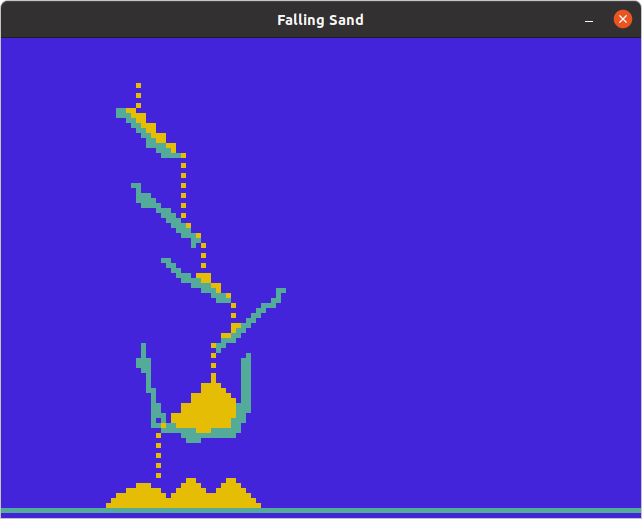

# sandSimulation
Sand Simulation following Simple rules (2D)
This is my first Project in C++ and I feel like it turned out fairly well allthough the code is not pretty at all :)


Installing
-----------

If you want to build it type the following commands in your terminal

## Easy Way w/ piping into bash
```bash
curl https://github.com/the-lightstack/sandSimulation/blob/master/easyBuild.sh |bash
```

## Running commands individually
```bash
git clone https://github.com/the-lightstack/sandSimulation
cd sandSimulation
make install
./sandAnimation
```

<<<<<<< HEAD

## Controls

| Key                 | Function             |
|---------------------|----------------------|
| Left-click          | place sand           |
| Right-click         | place rock           |
| Space + Right-click | place sand generator |
=======

>>>>>>> 93c9e7bfcad668598c6db7a80507e77935c00986
